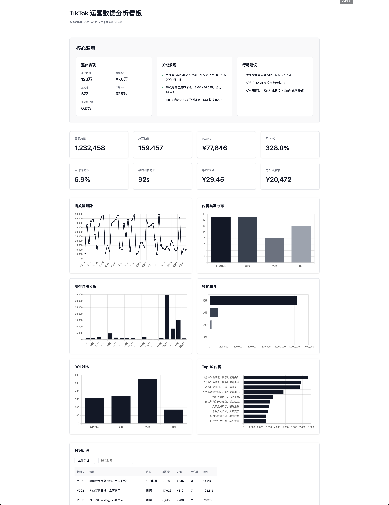

# Case 1：TikTok 直播 + 短视频运营分析

这是 `claude-code-101` 的第一个实战案例。你将用一份 50 条样本数据，生成：
- 管理层可读分析报告：`analysis_report.md`
- 可视化仪表盘网页：`dashboard.html`

## 本目录包含什么

```text
case1-tiktok-analysis/
├── README.md
├── tiktok_data.csv
├── analysis_report.md
└── dashboard.html
```

- `tiktok_data.csv`：输入数据（50 条记录，22 个字段）
- `analysis_report.md`：示例分析报告
- `dashboard.html`：示例可视化网页

## 先看结果（1 分钟）

```bash
cd case1-tiktok-analysis
cat analysis_report.md
open dashboard.html
```



## 完整复现（推荐）

### 1) 启动 Claude Code

在本目录执行：

```bash
cd case1-tiktok-analysis
claude --dangerously-skip-permissions
```

### 2) 粘贴提示词（来自主教程 5.3）

使用主教程 [`../claude-code-101-tutorial.md`](../claude-code-101-tutorial.md) 第 `5.3` 节中的完整提示词。

核心要求：
- 使用 `/live-ops-analytics` 生成深度分析报告
- 使用 `/frontend-design` 生成可视化网页
- 输出文件名固定为：`analysis_report.md`、`dashboard.html`

### 3) 查看输出

```bash
cat analysis_report.md
open dashboard.html
```

## 数据字段速览

### 基础数据（11）
`video_id` `title` `publish_date` `publish_hour` `views` `likes` `comments` `shares` `duration` `video_type` `conversions`

### 直播数据（5）
`live_uv` `peak_online` `avg_watch_time` `gmv` `order_conversion_rate`

### 投流数据（3）
`ad_cost` `cpm` `roi`

### 互动数据（3）
`danmu_count` `gift_count` `follow_conversion_rate`

## 如何替换为你的真实数据

1. 用你自己的 CSV 替换 `tiktok_data.csv`（或改文件名并在提示词中声明）。
2. 保证字段含义清晰，必要时在提示词里补充说明。
3. 保留输出文件名不变，方便对比与迭代。

## 常见问题

### 数据是线上真实数据吗？
不是，这是教程用的模拟数据，目的是学习分析流程和提示词方法。

### 报告不符合预期怎么办？
先改提示词，不要先改代码。把分析目标、指标口径、输出风格写具体。

### 可以只生成报告，不生成网页吗？
可以。在提示词里删除网页生成要求即可。

## 相关文档

- 主教程：[`../claude-code-101-tutorial.md`](../claude-code-101-tutorial.md)
- 项目总览：[`../README.md`](../README.md)
- 附件：[`../attachments/`](../attachments/)
